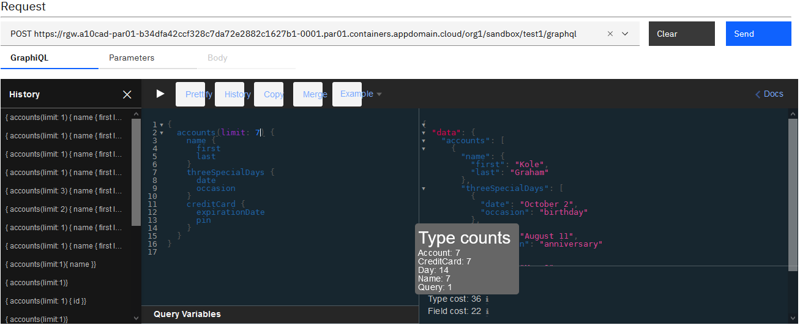

GraphQL in API Connect

GraphQL: The client is King but the GraphQL server is Prince


**WORK IN PROGRESS**

https://ec.yourlearning.ibm.com/w3/series/10101939?layout=grid

## Federation
https://www.apollographql.com/docs/federation/
Deutsche Bahn  https://bahnql.herokuapp.com/graphql


# Introduction: why GraphQL?
At its simplest, GraphQL is about asking for specific fields on objects.
Interest is growing significantly in 2109 and 2020


Problems solved by GraphQL API
* They help reduce the number of versions for an API
* Reduce the number of API calls required so improve significantly performances
* Reduce the amount of fetched data

Specifications
https://graphql.org
Latest version: https://spec.graphql.org/draft/

Implementations
The JavaScript reference implementation for GraphQL, a query language for APIs created by Facebook. https://www.npmjs.com/package/graphql
List of popular server-side frameworks, client libraries, services, ... https://graphql.org/code/
80000+ repositories on GraphQL: https://github.com/search?q=graphql
Create  queries for the data you need to integrate with GitHub https://docs.github.com/en/graphql

Available in many languages.

## Terminology and concepts
A query language and a runtime to fulfill queries
## REST versus GraphQL
Only one URL
Use POST (or GET with JSON **like** payload as parameter)
The message sent to the GraphQL server, the request, is JSON. The response is JSON.
The query define inside the JSON payload in the request is not JSON, but JSON like.

There is a content-type called application/graphQL


* **Queries** for reads (get data)
* Ask for data
* Ask for many parts at once
* Ask for only the parts you want

## Slicing/paging
max, limit, first, last
offset, cursor (advanced feature)


 * **Mutations** for changing the data
Modify the data - create/modify/delete (CUD)
Query the resulting data
Ask for many mutations at once
Query only the parts you need

* **subscriptions** (usually over websockets) (Not supported in APIC V10.0.0.0)
Subscribe to long-lived pub-sub stream of events
Query each event
Only once
Query only the parts you need

Notions of variables
{"a":"b"}
Notions of OperationName
operationName as a query parameters or inside the Query

**Introspections queries** get data types and operations a GraphQL server offers.


Client learns (automatically) about the data types and operations a GraphQL serve offers
It is a GraphQL query. It is just an extract.


The introspection policy is used for
* Eliminates the need to invoke backend for Introspection Response
* Use the schema published by the API developer instead of the schema from the backend
* Protect sensitive information from being revealed in the Portal
* Provides information regarding Introspection
* Improve performances

Popular and growing popularity. Downloads from npm doubling every your learning (GraphQL faster than npm). From Netflix 1000 a week.
Lots of language implementations
C#/.NET, Clojure, Elixir, Go, Groovy, Java, JavaScript, Julia, Katlin, Perl, PHP, Python, R, Ruby, Scala, Swift, OCaml/Reason

Solve usability and performance problems when accessing or changing data. And also versions, with too many API to provide support. Client wants new form of data from server.
The client is always right :-)

Support nested queries do not need a join like in SQL.

GitHub has two API V3 REST based API, V4 GraphQL API (195 kB versus 2.2 kB for example/ 24 requests versus 1 request)
https://developer.github.com/v4/explorer

Request
Get the name of the repository and the user login to this repository
```
query {
  repository(owner: "graphql", name: "graphql-js"){
    name
    description
  }
  viewer {
    login
  }
}
```

Response
```
{
  "data": {
    "repository": {
      "name": "graphql-js",
      "description": "A reference implementation of GraphQL for JavaScript"
    },
    "viewer": {
      "login": "ADesprets"
    }
  }
}
```


Sample mutation
Create an account and return me the id
Request
```
mutation {
  addAccount(input: {id: 123, name: {first: "John", last: "Doo"}}) {
    id
  }
}
```
Response
```
{
  "data": {
    "addAccount": {
      "id": "123"
    }
  }
}
```

Sample subscription (Not in V10.0.0.0)
Give me the name and date of creation of all the new repositories created from now
Request
```
subscription {
  newRepository {
    repository {
      name
      createdAt
    }
  }
}
```


# Simple Test
Goal is to implement the following:


From a use case perspective, implement a GraphQL API that provide information on continents and countries similar to the API here with the following schema:


## Create a lb4 API
See D:\CurrentProjects\APIMgt\Technical\lb4\README.md

## Create a GraphQL API in API Connect


Wizard Add API
Select From Existing GraphQL service (GraphQL proxy)


Add API select graphql
Enter the following  info
name: testgraphql
base path:
GraphQL server url: https://graphql-test-server.us-east.cf.appdomain.cloud/accounts/graphql (Best practice ends with graphql,only one end point)
Click next will get the schema (Warning 2 things dangerous)
This is the namespace name I just want to provide in my YAML (for example accounts)

When clicking Next it went to the GraphQL server and introspected the service.
You have the opportunity to decide what you want to expose.
rename the termination endpoint (not a good idea)
Support introspection, provide access to the GraphiQL editor
Expose or not the cost endpoint for a client.

In the next panel, you have the opportunity to uncheck the use of the client_id, there is a link that explains how to not use the client id. obviously the most standard approach and usual one is to use client_id

We can see in the GraphQL schema tab the schema that has been introspected
On the assembly what has been generated
We can see the various treatments (invoke, introspect, cost) and all the actions are explained

Cost is calculated by the analyzer (displayed in the assembly panel)
Over-estimating cost means rejecting good transactions
Under-estimating increase risks by not limiting dangerous transactions

assembly-panel

In the test panel, for the GraphiQL editor
We find the history, the request, the response and the documentations/schemas information

In Request: type ahead, real time error highlighting

In the trace part, we can see all the debug information

Do not need the introspection, because it is included in the GraphiQL editor.

The parse action is a standard DataPower action.
It has now a GraphQL document type


Parse description for graphql-input-type-cost (To be checked)
| Attribute      | description |
|----------------|------------ |
| use-app-id:    | false       |
| dynamic-value: | ''          |
| weight:        | >-          |
| is-client:     | true        |
| value:         | 1000/1hour  |
| use-client-id: | false       |
| cache-only:    | true        |
| use-api-name:  | false       |
| hard-limit:    | true        |

## Using the Test and Debug panel
Update the endpoint
https://rgw.adapiccluster-par01-b34dfa42ccf328c7da72e2882c1627b1-0001.par01.containers.appdomain.cloud/org1/sandbox/testgraphql/graphql

```
{
  accounts(limit: 3) {
    name {
      first
      last
    }
    shippingAddress {
      building
      street
      state
      zip
    }
  }
}
```

Another sample with filter (https://countries.trevorblades.com/)
```
{
  continents(filter: { code: { eq: "AN" } }) {
    code
    name
    countries {
      code
      name
      capital
      languages {
        name
      }
    }
  }
}
```

```
{
  continents (filter: {code: {regex: "AF|EU"}}) {
    name
    code
  }
}
```

```
{
  countries (filter: {currency: {eq: "EUR"}}){
    name
    currency
  }
}
```


Sample get countries using euro as currency
```
curl "https://countries.trevorblades.com/" -H "Accept: */*" -H "content-type: application/json" --data-raw "{""operationName"":null,""variables"":{},""query"":""{\n  countries(filter: {currency: {regex: \\""EUR\\""}}) {\n    name\n  }\n}\n""}"
```


## In Portal


Very practical the schema explorer (Documentation explorer) helps you to build the queries and the mutations in a very efficient way.


## GraphQL voyager
API Guru Voyager https://apis.guru/graphql-voyager/
Using the SDL from https://countries.trevorblades.com/


```
{
  continents {
    name
    countries {
      name
      continent {name}
    }
  }
}
```


## With curl
```
curl -k -H "Accept: application/json" -H "Content-Type: application/json" -H "X-IBM-Client-Id: 7ce2a087bbd75e465f0096054d5d3e58" -d "{\"query\": \"{accounts(limit: 3) {name {first last}shippingAddress {building street state zip}}}\", \"variables\": null}" https://rgw.adapiccluster-par01-b34dfa42ccf328c7da72e2882c1627b1-0001.par01.containers.appdomain.cloud/org1/sandbox/testgraphql/graphql |jq .
  % Total    % Received % Xferd  Average Speed   Time    Time     Time  Current
                                 Dload  Upload   Total   Spent    Left  Speed
100   548    0   433  100   115    433    115  0:00:01 --:--:--  0:00:01   975
{
  "data": {
    "accounts": [
      {
        "name": {
          "first": "Owen",
          "last": "Dickinson"
        },
        "shippingAddress": {
          "building": "02",
          "street": "Milton Manor",
          "state": "Vermont",
          "zip": "44252"
        }
      },
      {
        "name": {
          "first": "Anibal",
          "last": "Bednar"
        },
        "shippingAddress": {
          "building": "130",
          "street": "Morissette Lane",
          "state": "Iowa",
          "zip": "82624"
        }
      },
      {
        "name": {
          "first": "Mckayla",
          "last": "Rath"
        },
        "shippingAddress": {
          "building": "638",
          "street": "Jazmyn Street",
          "state": "Nevada",
          "zip": "39995"
        }
      }
    ]
  }
}
```

Working: + binary for the invoke
```
var queryS="{  countries(filter: {currency: {eq: \"EUR\"}}) { name }}";
var msga={"variables": null};
msga.query=queryS;
context.message.body.write(msga);
```


# Introspect the GraphiQL schema

# Securing GraphQL queries

Edit the schema for protection

## Authentication and quotas
Traditional API Security

## Gest the cost with curl
The "cost" does not relate purely to monetary cost but can take into account factors such as computational time, memory consumption, and other such factors, in addition to the actual financial costs associated with, say, using third-party systems to retrieve data.

Need to ask the backend to assess the various cost on the backend

This is a static analysis



Changing the type cost.
Changing the field cost. Cost will be based by the resolver implementation. The person writing the resolvers knows the cost of each resolver.
Cost may represent CPU, latency, money cost

Cost is calculate using gateway peering (not SLM), usual behavior for API Connect.
GraphQL rates limits: cost per second
Consume and Replenish


## Cost calculation
Bulk feature to edit more than one field at a time
Search/filter

### Handling lists
List size:
* assumed-size in the schema, allow to calculate correctly the type size

* unbound ListSize will provide wrong number if nothing is done
GraphQL help with slicing. Even if the schema does not provide any information on it.
In real world nobody return unbound lists

The result may have less.


```
curl -k -H "Accept: application/json" -H "Content-Type: application/json" -H "X-IBM-Client-Id: 7ce2a087bbd75e465f0096054d5d3e58" -d "{\"query\": \"{accounts(limit: 3) {name {first last}shippingAddress {building street state zip}}}\", \"variables\": null}" https://rgw.adapiccluster-par01-b34dfa42ccf328c7da72e2882c1627b1-0001.par01.containers.appdomain.cloud/org1/sandbox/testgraphql/graphql/cost | jq .
  % Total    % Received % Xferd  Average Speed   Time    Time     Time  Current
                                 Dload  Upload   Total   Spent    Left  Speed
100   344    0   229  100   115    229    115  0:00:01 --:--:--  0:00:01  2752
{
  "fieldCost": 2147483647,
  "typeCost": 2147483647,
  "typeCounts": {
    "Account": 2147483647,
    "Address": 2147483647,
    "Name": 2147483647,
    "Query": 1
  },
  "fieldCounts": {
    "Account.name": 2147483647,
    "Account.shippingAddress": 2147483647,
    "Query.accounts": 1
  }
}
```

## Edges


## A word on caching
Caching very difficult with GraphQL (Major issue)
use of POST, subset may have changed, etc ...
In the future APIC Gateway may try to do something

# Understanding API Event with GraphQL information

{ __schema { queryType { name } } }

curl -k -v "https://graphql-test-server.us-east.cf.appdomain.cloud/accounts/graphql?query=%7B%20__schema%20%7B%20queryType%20%7B%20name%20%7D%20%7D%20%7D"

{ __type(name: "Query") { name } }
curl -k -v "https://graphql-test-server.us-east.cf.appdomain.cloud/accounts/graphql?query=%7B%20__type(name%3A%20%22Query%22)%20%7B%20name%20%7D%20%7D"

{ __type(name: "account") { name } }
curl -k -v "https://graphql-test-server.us-east.cf.appdomain.cloud/accounts/graphql?query=%7B%20__type(name%3A%20%22account%22)%20%7B%20name%20%7D%20%7D"

curl 'https://countries.trevorblades.com/' -H 'Accept-Encoding: gzip, deflate, br' -H 'Content-Type: application/json' -H 'Accept: application/json' -H 'Connection: keep-alive' -H 'DNT: 1' -H 'Origin: https://countries.trevorblades.com' --data-binary '{"query":"# Write your query or mutation here\n{continents{name}}"}' --compressed


# Creating a GraphQL Server using loopback from A REST API
For more information see https://loopback.io/doc/en/lb4/GraphQL.html

https://loopback.io/doc/en/lb4/Using-openapi-to-graphql.html

We are going to create an API to query continents, and countries (please see the lb4 sample documentation)

Loopback acts as an integrator of the various data sources.

npm install --save @loopback/graphql

npm i openapi-to-graphql


npx openapi-to-graphql-cli --port=3001 http://localhost:3000/openapi.json


```
{
  todos {
    id
    desc
    isComplete
    tag
    title
  }
}
```

```
{
  todos(filter: {limit: 10, offset: 5}) {
    id
    title
    desc
  }
}
```

Mutation
```
mutation {
  todoControllerCreate(newTodoInput: {
    desc: "Yessss"
    title: "Take over Jupiter"
    isComplete: true
    tag: "Planet"
  }) {
    id
    title
  }
}
```

# Introspection queries samples
Used https://platform.ontotext.com/tutorials/graphql-introspection.html

curl -i -X POST -H "content-type: application/graphql" -d @introspect-query-simple-types.json https://graphql-test-server.us-east.cf.appdomain.cloud/accounts/graphql/
curl -i -X POST -H "content-type: application/graphql" -d @introspect-query-full.json https://graphql-test-server.us-east.cf.appdomain.cloud/accounts/graphql/
Sample 1
Request
```
query IntrospectionQuery {
  __schema {
    queryType {
      name
    }
    mutationType {
      name
    }
  }
}
```
Response
```
{
	"data": {
		"__schema": {
			"queryType": {
				"name": "Query"
			},
			"mutationType": {
				"name": "Mutation"
			}
		}
	}
}
```

Sample 2
Request
```
query IntrospectionQuery {
  __schema {
	types {
      name
	    kind
      description
    }
  }
}
```
Response
```
{
	"data": {
		"__schema": {
			"types": [
				{
					"name": "Query",
					"kind": "OBJECT",
					"description": ""
				},
				{
					"name": "Int",
					"kind": "SCALAR",
					"description": "The `Int` scalar type represents non-fractional signed whole numeric values. Int can represent values between -(2^31) and 2^31 - 1."
				},
				{
					"name": "Account",
					"kind": "OBJECT",
					"description": ""
				},
				{
					"name": "ID",
					"kind": "SCALAR",
					"description": "The `ID` scalar type represents a unique identifier, often used to refetch an object or as key for a cache. The ID type appears in a JSON response as a String; however, it is not intended to be human-readable. When expected as an input type, any string (such as `\"4\"`) or integer (such as `4`) input value will be accepted as an ID."
				},
				{
					"name": "Name",
					"kind": "OBJECT",
					"description": ""
				},
				{
					"name": "String",
					"kind": "SCALAR",
					"description": "The `String` scalar type represents textual data, represented as UTF-8 character sequences. The String type is most often used by GraphQL to represent free-form human-readable text."
				},
				{
					"name": "Day",
					"kind": "OBJECT",
					"description": ""
				},
				{
					"name": "Address",
					"kind": "OBJECT",
					"description": ""
				},
				{
					"name": "CreditCard",
					"kind": "OBJECT",
					"description": ""
				},
				{
					"name": "Mutation",
					"kind": "OBJECT",
					"description": ""
				},
				{
					"name": "AccountInput",
					"kind": "INPUT_OBJECT",
					"description": ""
				},
				{
					"name": "NameInput",
					"kind": "INPUT_OBJECT",
					"description": ""
				},
				{
					"name": "__Schema",
					"kind": "OBJECT",
					"description": "A GraphQL Schema defines the capabilities of a GraphQL server. It exposes all available types and directives on the server, as well as the entry points for query, mutation, and subscription operations."
				},
				{
					"name": "__Type",
					"kind": "OBJECT",
					"description": "The fundamental unit of any GraphQL Schema is the type. There are many kinds of types in GraphQL as represented by the `__TypeKind` enum.\n\nDepending on the kind of a type, certain fields describe information about that type. Scalar types provide no information beyond a name and description, while Enum types provide their values. Object and Interface types provide the fields they describe. Abstract types, Union and Interface, provide the Object types possible at runtime. List and NonNull types compose other types."
				},
				{
					"name": "__TypeKind",
					"kind": "ENUM",
					"description": "An enum describing what kind of type a given `__Type` is."
				},
				{
					"name": "Boolean",
					"kind": "SCALAR",
					"description": "The `Boolean` scalar type represents `true` or `false`."
				},
				{
					"name": "__Field",
					"kind": "OBJECT",
					"description": "Object and Interface types are described by a list of Fields, each of which has a name, potentially a list of arguments, and a return type."
				},
				{
					"name": "__InputValue",
					"kind": "OBJECT",
					"description": "Arguments provided to Fields or Directives and the input fields of an InputObject are represented as Input Values which describe their type and optionally a default value."
				},
				{
					"name": "__EnumValue",
					"kind": "OBJECT",
					"description": "One possible value for a given Enum. Enum values are unique values, not a placeholder for a string or numeric value. However an Enum value is returned in a JSON response as a string."
				},
				{
					"name": "__Directive",
					"kind": "OBJECT",
					"description": "A Directive provides a way to describe alternate runtime execution and type validation behavior in a GraphQL document.\n\nIn some cases, you need to provide options to alter GraphQL's execution behavior in ways field arguments will not suffice, such as conditionally including or skipping a field. Directives provide this by describing additional information to the executor."
				},
				{
					"name": "__DirectiveLocation",
					"kind": "ENUM",
					"description": "A Directive can be adjacent to many parts of the GraphQL language, a __DirectiveLocation describes one such possible adjacencies."
				}
			]
		}
	}
}
```

Sample 3 - Full
Request
```
query IntrospectionQuery {
  __schema {
    queryType { name }
    mutationType { name }
    subscriptionType { name }
    types {
      ...FullType
    }
    directives {
      name
      description
      args {
        ...InputValue
      }
    }
  }
}
fragment FullType on __Type {
  kind
  name
  description
  fields(includeDeprecated: true) {
    name
    description
    args {
      ...InputValue
    }
    type {
      ...TypeRef
    }
    isDeprecated
    deprecationReason
  }
  inputFields {
    ...InputValue
  }
  interfaces {
    ...TypeRef
  }
  enumValues(includeDeprecated: true) {
    name
    description
    isDeprecated
    deprecationReason
  }
  possibleTypes {
    ...TypeRef
  }
}
fragment InputValue on __InputValue {
  name
  description
  type { ...TypeRef }
  defaultValue
}
fragment TypeRef on __Type {
  kind
  name
  ofType {
    kind
    name
    ofType {
      kind
      name
      ofType {
        kind
        name
      }
    }
  }
}
```
Response
```
{
	"data": {
		"__schema": {
			"queryType": {
				"name": "Query"
			},
			"mutationType": {
				"name": "Mutation"
			},
			"subscriptionType": null,
			"types": [
				{
					"kind": "OBJECT",
					"name": "Query",
					"description": "",
					"fields": [
						{
							"name": "accounts",
							"description": "",
							"args": [
								{
									"name": "limit",
									"description": "",
									"type": {
										"kind": "SCALAR",
										"name": "Int",
										"ofType": null
									},
									"defaultValue": null
								}
							],
							"type": {
								"kind": "LIST",
								"name": null,
								"ofType": {
									"kind": "OBJECT",
									"name": "Account",
									"ofType": null
								}
							},
							"isDeprecated": false,
							"deprecationReason": null
						}
					],
					"inputFields": null,
					"interfaces": [],
					"enumValues": null,
					"possibleTypes": null
				},
				{
					"kind": "SCALAR",
					"name": "Int",
					"description": "The `Int` scalar type represents non-fractional signed whole numeric values. Int can represent values between -(2^31) and 2^31 - 1.",
					"fields": null,
					"inputFields": null,
					"interfaces": null,
					"enumValues": null,
					"possibleTypes": null
				},
				{
					"kind": "OBJECT",
					"name": "Account",
					"description": "",
					"fields": [
						{
							"name": "id",
							"description": "",
							"args": [],
							"type": {
								"kind": "SCALAR",
								"name": "ID",
								"ofType": null
							},
							"isDeprecated": false,
							"deprecationReason": null
						},
						{
							"name": "name",
							"description": "",
							"args": [],
							"type": {
								"kind": "OBJECT",
								"name": "Name",
								"ofType": null
							},
							"isDeprecated": false,
							"deprecationReason": null
						},
						{
							"name": "threeSpecialDays",
							"description": "",
							"args": [],
							"type": {
								"kind": "LIST",
								"name": null,
								"ofType": {
									"kind": "OBJECT",
									"name": "Day",
									"ofType": null
								}
							},
							"isDeprecated": false,
							"deprecationReason": null
						},
						{
							"name": "shippingAddress",
							"description": "",
							"args": [],
							"type": {
								"kind": "OBJECT",
								"name": "Address",
								"ofType": null
							},
							"isDeprecated": false,
							"deprecationReason": null
						},
						{
							"name": "creditCard",
							"description": "",
							"args": [],
							"type": {
								"kind": "OBJECT",
								"name": "CreditCard",
								"ofType": null
							},
							"isDeprecated": false,
							"deprecationReason": null
						}
					],
					"inputFields": null,
					"interfaces": [],
					"enumValues": null,
					"possibleTypes": null
				},
				{
					"kind": "SCALAR",
					"name": "ID",
					"description": "The `ID` scalar type represents a unique identifier, often used to refetch an object or as key for a cache. The ID type appears in a JSON response as a String; however, it is not intended to be human-readable. When expected as an input type, any string (such as `\"4\"`) or integer (such as `4`) input value will be accepted as an ID.",
					"fields": null,
					"inputFields": null,
					"interfaces": null,
					"enumValues": null,
					"possibleTypes": null
				},
				{
					"kind": "OBJECT",
					"name": "Name",
					"description": "",
					"fields": [
						{
							"name": "first",
							"description": "",
							"args": [],
							"type": {
								"kind": "SCALAR",
								"name": "String",
								"ofType": null
							},
							"isDeprecated": false,
							"deprecationReason": null
						},
						{
							"name": "last",
							"description": "",
							"args": [],
							"type": {
								"kind": "SCALAR",
								"name": "String",
								"ofType": null
							},
							"isDeprecated": false,
							"deprecationReason": null
						}
					],
					"inputFields": null,
					"interfaces": [],
					"enumValues": null,
					"possibleTypes": null
				},
				{
					"kind": "SCALAR",
					"name": "String",
					"description": "The `String` scalar type represents textual data, represented as UTF-8 character sequences. The String type is most often used by GraphQL to represent free-form human-readable text.",
					"fields": null,
					"inputFields": null,
					"interfaces": null,
					"enumValues": null,
					"possibleTypes": null
				},
				{
					"kind": "OBJECT",
					"name": "Day",
					"description": "",
					"fields": [
						{
							"name": "date",
							"description": "",
							"args": [],
							"type": {
								"kind": "SCALAR",
								"name": "String",
								"ofType": null
							},
							"isDeprecated": false,
							"deprecationReason": null
						},
						{
							"name": "occasion",
							"description": "",
							"args": [],
							"type": {
								"kind": "SCALAR",
								"name": "String",
								"ofType": null
							},
							"isDeprecated": false,
							"deprecationReason": null
						}
					],
					"inputFields": null,
					"interfaces": [],
					"enumValues": null,
					"possibleTypes": null
				},
				{
					"kind": "OBJECT",
					"name": "Address",
					"description": "",
					"fields": [
						{
							"name": "country",
							"description": "",
							"args": [],
							"type": {
								"kind": "SCALAR",
								"name": "String",
								"ofType": null
							},
							"isDeprecated": false,
							"deprecationReason": null
						},
						{
							"name": "street",
							"description": "",
							"args": [],
							"type": {
								"kind": "SCALAR",
								"name": "String",
								"ofType": null
							},
							"isDeprecated": false,
							"deprecationReason": null
						},
						{
							"name": "state",
							"description": "",
							"args": [],
							"type": {
								"kind": "SCALAR",
								"name": "String",
								"ofType": null
							},
							"isDeprecated": false,
							"deprecationReason": null
						},
						{
							"name": "zip",
							"description": "",
							"args": [],
							"type": {
								"kind": "SCALAR",
								"name": "String",
								"ofType": null
							},
							"isDeprecated": false,
							"deprecationReason": null
						},
						{
							"name": "building",
							"description": "",
							"args": [],
							"type": {
								"kind": "SCALAR",
								"name": "String",
								"ofType": null
							},
							"isDeprecated": false,
							"deprecationReason": null
						}
					],
					"inputFields": null,
					"interfaces": [],
					"enumValues": null,
					"possibleTypes": null
				},
				{
					"kind": "OBJECT",
					"name": "CreditCard",
					"description": "",
					"fields": [
						{
							"name": "number",
							"description": "",
							"args": [],
							"type": {
								"kind": "SCALAR",
								"name": "String",
								"ofType": null
							},
							"isDeprecated": false,
							"deprecationReason": null
						},
						{
							"name": "pin",
							"description": "",
							"args": [],
							"type": {
								"kind": "SCALAR",
								"name": "Int",
								"ofType": null
							},
							"isDeprecated": false,
							"deprecationReason": null
						},
						{
							"name": "expirationDate",
							"description": "",
							"args": [],
							"type": {
								"kind": "SCALAR",
								"name": "String",
								"ofType": null
							},
							"isDeprecated": false,
							"deprecationReason": null
						}
					],
					"inputFields": null,
					"interfaces": [],
					"enumValues": null,
					"possibleTypes": null
				},
				{
					"kind": "OBJECT",
					"name": "Mutation",
					"description": "",
					"fields": [
						{
							"name": "addAccount",
							"description": "",
							"args": [
								{
									"name": "input",
									"description": "",
									"type": {
										"kind": "NON_NULL",
										"name": null,
										"ofType": {
											"kind": "INPUT_OBJECT",
											"name": "AccountInput",
											"ofType": null
										}
									},
									"defaultValue": null
								}
							],
							"type": {
								"kind": "OBJECT",
								"name": "Account",
								"ofType": null
							},
							"isDeprecated": false,
							"deprecationReason": null
						}
					],
					"inputFields": null,
					"interfaces": [],
					"enumValues": null,
					"possibleTypes": null
				},
				{
					"kind": "INPUT_OBJECT",
					"name": "AccountInput",
					"description": "",
					"fields": null,
					"inputFields": [
						{
							"name": "id",
							"description": "",
							"type": {
								"kind": "NON_NULL",
								"name": null,
								"ofType": {
									"kind": "SCALAR",
									"name": "ID",
									"ofType": null
								}
							},
							"defaultValue": null
						},
						{
							"name": "name",
							"description": "",
							"type": {
								"kind": "INPUT_OBJECT",
								"name": "NameInput",
								"ofType": null
							},
							"defaultValue": null
						}
					],
					"interfaces": null,
					"enumValues": null,
					"possibleTypes": null
				},
				{
					"kind": "INPUT_OBJECT",
					"name": "NameInput",
					"description": "",
					"fields": null,
					"inputFields": [
						{
							"name": "first",
							"description": "",
							"type": {
								"kind": "SCALAR",
								"name": "String",
								"ofType": null
							},
							"defaultValue": null
						},
						{
							"name": "last",
							"description": "",
							"type": {
								"kind": "SCALAR",
								"name": "String",
								"ofType": null
							},
							"defaultValue": null
						}
					],
					"interfaces": null,
					"enumValues": null,
					"possibleTypes": null
				},
				{
					"kind": "OBJECT",
					"name": "__Schema",
					"description": "A GraphQL Schema defines the capabilities of a GraphQL server. It exposes all available types and directives on the server, as well as the entry points for query, mutation, and subscription operations.",
					"fields": [
						{
							"name": "types",
							"description": "A list of all types supported by this server.",
							"args": [],
							"type": {
								"kind": "NON_NULL",
								"name": null,
								"ofType": {
									"kind": "LIST",
									"name": null,
									"ofType": {
										"kind": "NON_NULL",
										"name": null,
										"ofType": {
											"kind": "OBJECT",
											"name": "__Type"
										}
									}
								}
							},
							"isDeprecated": false,
							"deprecationReason": null
						},
						{
							"name": "queryType",
							"description": "The type that query operations will be rooted at.",
							"args": [],
							"type": {
								"kind": "NON_NULL",
								"name": null,
								"ofType": {
									"kind": "OBJECT",
									"name": "__Type",
									"ofType": null
								}
							},
							"isDeprecated": false,
							"deprecationReason": null
						},
						{
							"name": "mutationType",
							"description": "If this server supports mutation, the type that mutation operations will be rooted at.",
							"args": [],
							"type": {
								"kind": "OBJECT",
								"name": "__Type",
								"ofType": null
							},
							"isDeprecated": false,
							"deprecationReason": null
						},
						{
							"name": "subscriptionType",
							"description": "If this server support subscription, the type that subscription operations will be rooted at.",
							"args": [],
							"type": {
								"kind": "OBJECT",
								"name": "__Type",
								"ofType": null
							},
							"isDeprecated": false,
							"deprecationReason": null
						},
						{
							"name": "directives",
							"description": "A list of all directives supported by this server.",
							"args": [],
							"type": {
								"kind": "NON_NULL",
								"name": null,
								"ofType": {
									"kind": "LIST",
									"name": null,
									"ofType": {
										"kind": "NON_NULL",
										"name": null,
										"ofType": {
											"kind": "OBJECT",
											"name": "__Directive"
										}
									}
								}
							},
							"isDeprecated": false,
							"deprecationReason": null
						}
					],
					"inputFields": null,
					"interfaces": [],
					"enumValues": null,
					"possibleTypes": null
				},
				{
					"kind": "OBJECT",
					"name": "__Type",
					"description": "The fundamental unit of any GraphQL Schema is the type. There are many kinds of types in GraphQL as represented by the `__TypeKind` enum.\n\nDepending on the kind of a type, certain fields describe information about that type. Scalar types provide no information beyond a name and description, while Enum types provide their values. Object and Interface types provide the fields they describe. Abstract types, Union and Interface, provide the Object types possible at runtime. List and NonNull types compose other types.",
					"fields": [
						{
							"name": "kind",
							"description": null,
							"args": [],
							"type": {
								"kind": "NON_NULL",
								"name": null,
								"ofType": {
									"kind": "ENUM",
									"name": "__TypeKind",
									"ofType": null
								}
							},
							"isDeprecated": false,
							"deprecationReason": null
						},
						{
							"name": "name",
							"description": null,
							"args": [],
							"type": {
								"kind": "SCALAR",
								"name": "String",
								"ofType": null
							},
							"isDeprecated": false,
							"deprecationReason": null
						},
						{
							"name": "description",
							"description": null,
							"args": [],
							"type": {
								"kind": "SCALAR",
								"name": "String",
								"ofType": null
							},
							"isDeprecated": false,
							"deprecationReason": null
						},
						{
							"name": "fields",
							"description": null,
							"args": [
								{
									"name": "includeDeprecated",
									"description": null,
									"type": {
										"kind": "SCALAR",
										"name": "Boolean",
										"ofType": null
									},
									"defaultValue": "false"
								}
							],
							"type": {
								"kind": "LIST",
								"name": null,
								"ofType": {
									"kind": "NON_NULL",
									"name": null,
									"ofType": {
										"kind": "OBJECT",
										"name": "__Field",
										"ofType": null
									}
								}
							},
							"isDeprecated": false,
							"deprecationReason": null
						},
						{
							"name": "interfaces",
							"description": null,
							"args": [],
							"type": {
								"kind": "LIST",
								"name": null,
								"ofType": {
									"kind": "NON_NULL",
									"name": null,
									"ofType": {
										"kind": "OBJECT",
										"name": "__Type",
										"ofType": null
									}
								}
							},
							"isDeprecated": false,
							"deprecationReason": null
						},
						{
							"name": "possibleTypes",
							"description": null,
							"args": [],
							"type": {
								"kind": "LIST",
								"name": null,
								"ofType": {
									"kind": "NON_NULL",
									"name": null,
									"ofType": {
										"kind": "OBJECT",
										"name": "__Type",
										"ofType": null
									}
								}
							},
							"isDeprecated": false,
							"deprecationReason": null
						},
						{
							"name": "enumValues",
							"description": null,
							"args": [
								{
									"name": "includeDeprecated",
									"description": null,
									"type": {
										"kind": "SCALAR",
										"name": "Boolean",
										"ofType": null
									},
									"defaultValue": "false"
								}
							],
							"type": {
								"kind": "LIST",
								"name": null,
								"ofType": {
									"kind": "NON_NULL",
									"name": null,
									"ofType": {
										"kind": "OBJECT",
										"name": "__EnumValue",
										"ofType": null
									}
								}
							},
							"isDeprecated": false,
							"deprecationReason": null
						},
						{
							"name": "inputFields",
							"description": null,
							"args": [],
							"type": {
								"kind": "LIST",
								"name": null,
								"ofType": {
									"kind": "NON_NULL",
									"name": null,
									"ofType": {
										"kind": "OBJECT",
										"name": "__InputValue",
										"ofType": null
									}
								}
							},
							"isDeprecated": false,
							"deprecationReason": null
						},
						{
							"name": "ofType",
							"description": null,
							"args": [],
							"type": {
								"kind": "OBJECT",
								"name": "__Type",
								"ofType": null
							},
							"isDeprecated": false,
							"deprecationReason": null
						}
					],
					"inputFields": null,
					"interfaces": [],
					"enumValues": null,
					"possibleTypes": null
				},
				{
					"kind": "ENUM",
					"name": "__TypeKind",
					"description": "An enum describing what kind of type a given `__Type` is.",
					"fields": null,
					"inputFields": null,
					"interfaces": null,
					"enumValues": [
						{
							"name": "SCALAR",
							"description": "Indicates this type is a scalar.",
							"isDeprecated": false,
							"deprecationReason": null
						},
						{
							"name": "OBJECT",
							"description": "Indicates this type is an object. `fields` and `interfaces` are valid fields.",
							"isDeprecated": false,
							"deprecationReason": null
						},
						{
							"name": "INTERFACE",
							"description": "Indicates this type is an interface. `fields` and `possibleTypes` are valid fields.",
							"isDeprecated": false,
							"deprecationReason": null
						},
						{
							"name": "UNION",
							"description": "Indicates this type is a union. `possibleTypes` is a valid field.",
							"isDeprecated": false,
							"deprecationReason": null
						},
						{
							"name": "ENUM",
							"description": "Indicates this type is an enum. `enumValues` is a valid field.",
							"isDeprecated": false,
							"deprecationReason": null
						},
						{
							"name": "INPUT_OBJECT",
							"description": "Indicates this type is an input object. `inputFields` is a valid field.",
							"isDeprecated": false,
							"deprecationReason": null
						},
						{
							"name": "LIST",
							"description": "Indicates this type is a list. `ofType` is a valid field.",
							"isDeprecated": false,
							"deprecationReason": null
						},
						{
							"name": "NON_NULL",
							"description": "Indicates this type is a non-null. `ofType` is a valid field.",
							"isDeprecated": false,
							"deprecationReason": null
						}
					],
					"possibleTypes": null
				},
				{
					"kind": "SCALAR",
					"name": "Boolean",
					"description": "The `Boolean` scalar type represents `true` or `false`.",
					"fields": null,
					"inputFields": null,
					"interfaces": null,
					"enumValues": null,
					"possibleTypes": null
				},
				{
					"kind": "OBJECT",
					"name": "__Field",
					"description": "Object and Interface types are described by a list of Fields, each of which has a name, potentially a list of arguments, and a return type.",
					"fields": [
						{
							"name": "name",
							"description": null,
							"args": [],
							"type": {
								"kind": "NON_NULL",
								"name": null,
								"ofType": {
									"kind": "SCALAR",
									"name": "String",
									"ofType": null
								}
							},
							"isDeprecated": false,
							"deprecationReason": null
						},
						{
							"name": "description",
							"description": null,
							"args": [],
							"type": {
								"kind": "SCALAR",
								"name": "String",
								"ofType": null
							},
							"isDeprecated": false,
							"deprecationReason": null
						},
						{
							"name": "args",
							"description": null,
							"args": [],
							"type": {
								"kind": "NON_NULL",
								"name": null,
								"ofType": {
									"kind": "LIST",
									"name": null,
									"ofType": {
										"kind": "NON_NULL",
										"name": null,
										"ofType": {
											"kind": "OBJECT",
											"name": "__InputValue"
										}
									}
								}
							},
							"isDeprecated": false,
							"deprecationReason": null
						},
						{
							"name": "type",
							"description": null,
							"args": [],
							"type": {
								"kind": "NON_NULL",
								"name": null,
								"ofType": {
									"kind": "OBJECT",
									"name": "__Type",
									"ofType": null
								}
							},
							"isDeprecated": false,
							"deprecationReason": null
						},
						{
							"name": "isDeprecated",
							"description": null,
							"args": [],
							"type": {
								"kind": "NON_NULL",
								"name": null,
								"ofType": {
									"kind": "SCALAR",
									"name": "Boolean",
									"ofType": null
								}
							},
							"isDeprecated": false,
							"deprecationReason": null
						},
						{
							"name": "deprecationReason",
							"description": null,
							"args": [],
							"type": {
								"kind": "SCALAR",
								"name": "String",
								"ofType": null
							},
							"isDeprecated": false,
							"deprecationReason": null
						}
					],
					"inputFields": null,
					"interfaces": [],
					"enumValues": null,
					"possibleTypes": null
				},
				{
					"kind": "OBJECT",
					"name": "__InputValue",
					"description": "Arguments provided to Fields or Directives and the input fields of an InputObject are represented as Input Values which describe their type and optionally a default value.",
					"fields": [
						{
							"name": "name",
							"description": null,
							"args": [],
							"type": {
								"kind": "NON_NULL",
								"name": null,
								"ofType": {
									"kind": "SCALAR",
									"name": "String",
									"ofType": null
								}
							},
							"isDeprecated": false,
							"deprecationReason": null
						},
						{
							"name": "description",
							"description": null,
							"args": [],
							"type": {
								"kind": "SCALAR",
								"name": "String",
								"ofType": null
							},
							"isDeprecated": false,
							"deprecationReason": null
						},
						{
							"name": "type",
							"description": null,
							"args": [],
							"type": {
								"kind": "NON_NULL",
								"name": null,
								"ofType": {
									"kind": "OBJECT",
									"name": "__Type",
									"ofType": null
								}
							},
							"isDeprecated": false,
							"deprecationReason": null
						},
						{
							"name": "defaultValue",
							"description": "A GraphQL-formatted string representing the default value for this input value.",
							"args": [],
							"type": {
								"kind": "SCALAR",
								"name": "String",
								"ofType": null
							},
							"isDeprecated": false,
							"deprecationReason": null
						}
					],
					"inputFields": null,
					"interfaces": [],
					"enumValues": null,
					"possibleTypes": null
				},
				{
					"kind": "OBJECT",
					"name": "__EnumValue",
					"description": "One possible value for a given Enum. Enum values are unique values, not a placeholder for a string or numeric value. However an Enum value is returned in a JSON response as a string.",
					"fields": [
						{
							"name": "name",
							"description": null,
							"args": [],
							"type": {
								"kind": "NON_NULL",
								"name": null,
								"ofType": {
									"kind": "SCALAR",
									"name": "String",
									"ofType": null
								}
							},
							"isDeprecated": false,
							"deprecationReason": null
						},
						{
							"name": "description",
							"description": null,
							"args": [],
							"type": {
								"kind": "SCALAR",
								"name": "String",
								"ofType": null
							},
							"isDeprecated": false,
							"deprecationReason": null
						},
						{
							"name": "isDeprecated",
							"description": null,
							"args": [],
							"type": {
								"kind": "NON_NULL",
								"name": null,
								"ofType": {
									"kind": "SCALAR",
									"name": "Boolean",
									"ofType": null
								}
							},
							"isDeprecated": false,
							"deprecationReason": null
						},
						{
							"name": "deprecationReason",
							"description": null,
							"args": [],
							"type": {
								"kind": "SCALAR",
								"name": "String",
								"ofType": null
							},
							"isDeprecated": false,
							"deprecationReason": null
						}
					],
					"inputFields": null,
					"interfaces": [],
					"enumValues": null,
					"possibleTypes": null
				},
				{
					"kind": "OBJECT",
					"name": "__Directive",
					"description": "A Directive provides a way to describe alternate runtime execution and type validation behavior in a GraphQL document.\n\nIn some cases, you need to provide options to alter GraphQL's execution behavior in ways field arguments will not suffice, such as conditionally including or skipping a field. Directives provide this by describing additional information to the executor.",
					"fields": [
						{
							"name": "name",
							"description": null,
							"args": [],
							"type": {
								"kind": "NON_NULL",
								"name": null,
								"ofType": {
									"kind": "SCALAR",
									"name": "String",
									"ofType": null
								}
							},
							"isDeprecated": false,
							"deprecationReason": null
						},
						{
							"name": "description",
							"description": null,
							"args": [],
							"type": {
								"kind": "SCALAR",
								"name": "String",
								"ofType": null
							},
							"isDeprecated": false,
							"deprecationReason": null
						},
						{
							"name": "locations",
							"description": null,
							"args": [],
							"type": {
								"kind": "NON_NULL",
								"name": null,
								"ofType": {
									"kind": "LIST",
									"name": null,
									"ofType": {
										"kind": "NON_NULL",
										"name": null,
										"ofType": {
											"kind": "ENUM",
											"name": "__DirectiveLocation"
										}
									}
								}
							},
							"isDeprecated": false,
							"deprecationReason": null
						},
						{
							"name": "args",
							"description": null,
							"args": [],
							"type": {
								"kind": "NON_NULL",
								"name": null,
								"ofType": {
									"kind": "LIST",
									"name": null,
									"ofType": {
										"kind": "NON_NULL",
										"name": null,
										"ofType": {
											"kind": "OBJECT",
											"name": "__InputValue"
										}
									}
								}
							},
							"isDeprecated": false,
							"deprecationReason": null
						}
					],
					"inputFields": null,
					"interfaces": [],
					"enumValues": null,
					"possibleTypes": null
				},
				{
					"kind": "ENUM",
					"name": "__DirectiveLocation",
					"description": "A Directive can be adjacent to many parts of the GraphQL language, a __DirectiveLocation describes one such possible adjacencies.",
					"fields": null,
					"inputFields": null,
					"interfaces": null,
					"enumValues": [
						{
							"name": "QUERY",
							"description": "Location adjacent to a query operation.",
							"isDeprecated": false,
							"deprecationReason": null
						},
						{
							"name": "MUTATION",
							"description": "Location adjacent to a mutation operation.",
							"isDeprecated": false,
							"deprecationReason": null
						},
						{
							"name": "SUBSCRIPTION",
							"description": "Location adjacent to a subscription operation.",
							"isDeprecated": false,
							"deprecationReason": null
						},
						{
							"name": "FIELD",
							"description": "Location adjacent to a field.",
							"isDeprecated": false,
							"deprecationReason": null
						},
						{
							"name": "FRAGMENT_DEFINITION",
							"description": "Location adjacent to a fragment definition.",
							"isDeprecated": false,
							"deprecationReason": null
						},
						{
							"name": "FRAGMENT_SPREAD",
							"description": "Location adjacent to a fragment spread.",
							"isDeprecated": false,
							"deprecationReason": null
						},
						{
							"name": "INLINE_FRAGMENT",
							"description": "Location adjacent to an inline fragment.",
							"isDeprecated": false,
							"deprecationReason": null
						},
						{
							"name": "VARIABLE_DEFINITION",
							"description": "Location adjacent to a variable definition.",
							"isDeprecated": false,
							"deprecationReason": null
						},
						{
							"name": "SCHEMA",
							"description": "Location adjacent to a schema definition.",
							"isDeprecated": false,
							"deprecationReason": null
						},
						{
							"name": "SCALAR",
							"description": "Location adjacent to a scalar definition.",
							"isDeprecated": false,
							"deprecationReason": null
						},
						{
							"name": "OBJECT",
							"description": "Location adjacent to an object type definition.",
							"isDeprecated": false,
							"deprecationReason": null
						},
						{
							"name": "FIELD_DEFINITION",
							"description": "Location adjacent to a field definition.",
							"isDeprecated": false,
							"deprecationReason": null
						},
						{
							"name": "ARGUMENT_DEFINITION",
							"description": "Location adjacent to an argument definition.",
							"isDeprecated": false,
							"deprecationReason": null
						},
						{
							"name": "INTERFACE",
							"description": "Location adjacent to an interface definition.",
							"isDeprecated": false,
							"deprecationReason": null
						},
						{
							"name": "UNION",
							"description": "Location adjacent to a union definition.",
							"isDeprecated": false,
							"deprecationReason": null
						},
						{
							"name": "ENUM",
							"description": "Location adjacent to an enum definition.",
							"isDeprecated": false,
							"deprecationReason": null
						},
						{
							"name": "ENUM_VALUE",
							"description": "Location adjacent to an enum value definition.",
							"isDeprecated": false,
							"deprecationReason": null
						},
						{
							"name": "INPUT_OBJECT",
							"description": "Location adjacent to an input object type definition.",
							"isDeprecated": false,
							"deprecationReason": null
						},
						{
							"name": "INPUT_FIELD_DEFINITION",
							"description": "Location adjacent to an input object field definition.",
							"isDeprecated": false,
							"deprecationReason": null
						}
					],
					"possibleTypes": null
				}
			],
			"directives": [
				{
					"name": "skip",
					"description": "Directs the executor to skip this field or fragment when the `if` argument is true.",
					"args": [
						{
							"name": "if",
							"description": "Skipped when true.",
							"type": {
								"kind": "NON_NULL",
								"name": null,
								"ofType": {
									"kind": "SCALAR",
									"name": "Boolean",
									"ofType": null
								}
							},
							"defaultValue": null
						}
					]
				},
				{
					"name": "include",
					"description": "Directs the executor to include this field or fragment only when the `if` argument is true.",
					"args": [
						{
							"name": "if",
							"description": "Included when true.",
							"type": {
								"kind": "NON_NULL",
								"name": null,
								"ofType": {
									"kind": "SCALAR",
									"name": "Boolean",
									"ofType": null
								}
							},
							"defaultValue": null
						}
					]
				},
				{
					"name": "deprecated",
					"description": "Marks an element of a GraphQL schema as no longer supported.",
					"args": [
						{
							"name": "reason",
							"description": "Explains why this element was deprecated, usually also including a suggestion for how to access supported similar data. Formatted using the Markdown syntax (as specified by [CommonMark](https://commonmark.org/).",
							"type": {
								"kind": "SCALAR",
								"name": "String",
								"ofType": null
							},
							"defaultValue": "\"No longer supported\""
						}
					]
				}
			]
		}
	}
}
```
Sample 4
Request
```
```
Response
```
```
